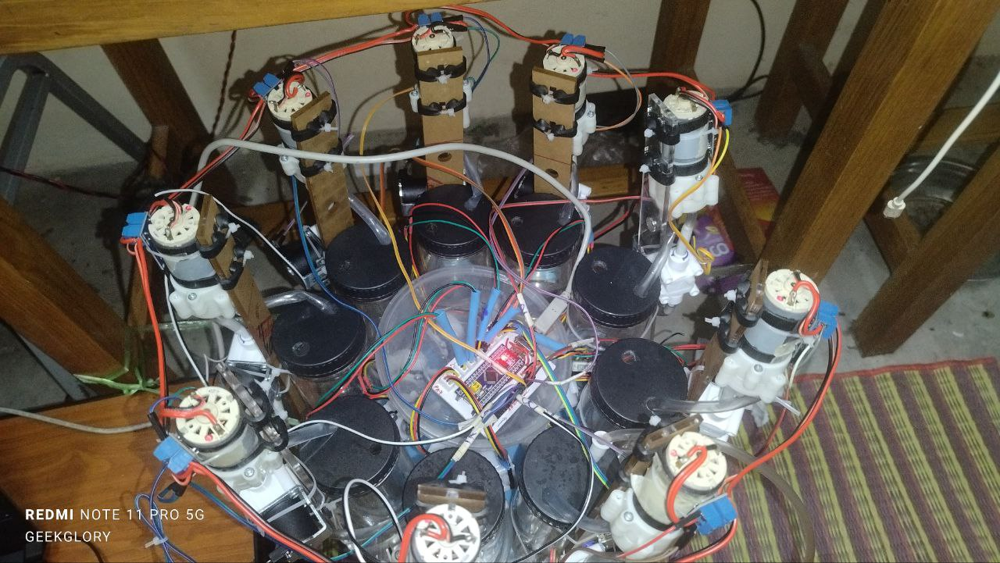
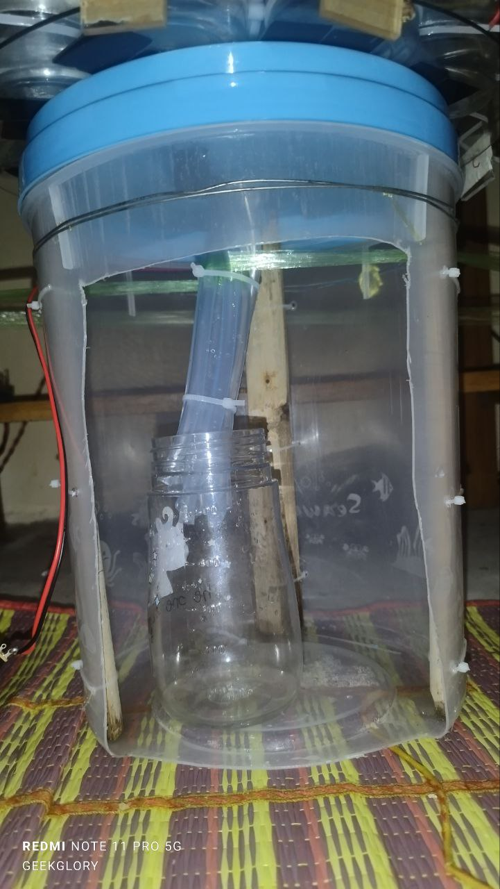
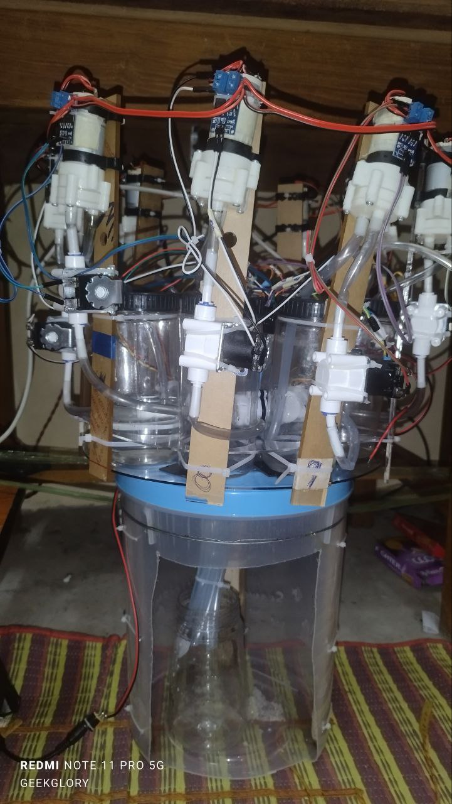

# STM32 Multi-Pump Water Dispensing System 🚰

This project controls up to 9 water pumps with independent flow sensors using an STM32 microcontroller. Each pump dispenses a user-defined volume of water in milliliters (mL), and the system adjusts output using calibration factors or time-based estimates.

## 🚀 Features

- 🔢 Supports **9 pumps** and **9 flow sensors**
- 🧠 **Volume-based control** using calibration (Pumps 1–7 & 9)
- ⏱️ **Time-based fake dispensing** (Pump 8 only – no sensor!)
- 🧪 Real-time serial feedback for debugging and monitoring
- 🔧 Dynamic calibration adjustment via serial input
- 🛑 Emergency stop for all pumps
- 🗨️ Clear serial command interface


## 📁 Directory Structure

```
stm32-water-dispense-controller/
├── .vscode/                    # VSCode settings (PlatformIO or Arduino config)
├── include/                   # Header files (if any)
├── lib/                       # External libraries (if used)
├── src/                       # Main firmware source files (multi-pump tests, etc.)
│   ├── main.cpp
│   ├── main1.cpp
│   ├── main2.cpp
│   ├── img
│   |    ├── Bottle.jpg
│   |    ├── Circuit.jpg
│   |    ├── Overall.jpg
│   ├── flowsensortester/
│   ├── Testing1pump1sensor/
│   │   ├── testing1pumpsensor.cpp
│   │   └── README.md
│   ├── Testing2pump2sensor/
│   │   ├── testing2pumpsensor.cpp
│   │   └── README.md
│   ├── Testing3pump3sensor/
│   │   ├── testing3pumpsensor.cpp
│   │   └── README.md
│   ├── testing4pumpsensor.cpp
│   │   ├── testing4pumpsensor.cpp
│   │   └── README.md
│   ├── testing5pumpsensor.cpp
│   │   ├── testing5pumpsensor.cpp
│   │   └── README.md
│   ├── testing6pumpsensor.cpp
│   │   ├── testing1pumpsensor.cpp
│   │   └── README.md
│   ├── testing7pumpsensor.cpp
│   │   ├── testing7pumpsensor.cpp
│   │   └── README.md
│   ├── testing8pumpsensor.cpp
│   │   ├── testing8pumpsensor.cpp
│   │   └── README.md
│   ├── testing9pumpsensor.cpp
│   │   ├── testing9pumpsensor.cpp
│   │   └── README.md
│   ├── testingfaultysensor.cpp
├── test/                      # Unit tests (if needed)
├── .gitignore                 # Git ignore rules
├── CS50 Python.code-workspace # Workspace config (This is from another project!)
├── stm32hardware.code-workspace
└── platformio.ini             # PlatformIO project config
```

## 🛠️ Hardware Pin Mapping

| Pump | Pump Pin | Sensor Pin | Notes               |
|------|----------|------------|---------------------|
| 1    | PB9      | PA0        | Calibrated flow     |
| 2    | PB8      | PA1        | Calibrated flow     |
| 3    | PB7      | PA2        | Calibrated flow     |
| 4    | PB6      | PA3        | Calibrated flow     |
| 5    | PB5      | PA4        | Calibrated flow     |
| 6    | PB4      | PA5        | Calibrated flow     |
| 7    | PB3      | PA6        | Calibrated flow     |
| 8    | PA15     | N/A        | **Time-based only** |
| 9    | PA12     | PA8        | Calibrated flow     |

---

## 📘 Serial Commands

### ✅ Dispense

```

D<id>:<volume>

```

- Example: `D3:100` → Pump 3 will dispense 100 mL using pulse counting.
- Pump 8 uses time-based durations.

---

### ⚙️ Update Calibration

```

D<id>:<volume>:<cal>@<range>

```

- Example: `D5:100:12.4@1` → Sets calibration of Pump 5 Range 1 to 12.4, then dispenses 100 mL.
- **Pump 8 ignores calibration changes.**

---

### 🛠️ Set Calibration Only

```

R:<range>:<cal>

```

- Example: `R:2:31.5` → Set calibration factor for range 2 of the active pump.
- Only works with Pumps 1–7 & 9.

---

### 📊 Show Calibration

```

C

```

- Shows all calibration values.

```

C8

```

- Shows fake calibration values for Pump 8 only.

---

### 🛑 Stop Pumps

```

S

````

- Stops all pumps immediately.

---

## 📦 Calibration Defaults

Each pump uses 4 calibration ranges:

| Range        | Volume (mL)     |
|--------------|-----------------|
| Range 0      | 0–50 mL         |
| Range 1      | 51–100 mL       |
| Range 2      | 101–150 mL      |
| Range 3      | 151–1000 mL     |

Each pump has its own default values hardcoded in the source file.

---

## ❗ Pump 8 Special Case

Pump 8's flow sensor was faulty. So instead, the pump operates **based on estimated duration**:

| Volume | Duration (s) |
|--------|--------------|
| 50 mL  | 6.236 s      |
| 100 mL | 12.208 s     |
| 150 mL | 18.400 s     |

No real calibration is used — just fake reporting for consistency.

---

## 🧠 Example Usage

```text
D1:100         // Pump 1 dispenses 100 mL
D8:50          // Pump 8 runs for 6.236s (fake 50 mL)
C              // Show calibration values
S              // Stop all pumps
````

## 📌 Prototype Demo Videos 
```
### 💧 Water Dispensing System | STM32 Blue Pill + Python GUI  
```
---
  
#### 📌 💧 Water Dispensing System | STM32 Blue Pill + Python GUI (Prototype Demo) Part 1
[](https://youtu.be/rZtVd0Mnc2o)  

#### 📌 💧 Water Dispensing System | STM32 Blue Pill + Python GUI (Prototype Demo) Part 2 
[](https://youtu.be/Hda0gbTluGE)  

#### 📌 💧 Water Dispensing System | STM32 Blue Pill + Python GUI (Prototype Demo) Part 3 
[](https://youtu.be/YB9_dY_8Kjg)  

#### 📌 💧 Water Dispensing System | STM32 Blue Pill + Python GUI (Prototype Demo) Part 4
[](https://youtu.be/yIh98R7sNp0)  

---

## 📸 Project Images

### 1. Circuit Diagram
  

### 2. Bottle Design
  

### 3. Overall Setup


## 🧑‍💻 Developed By

Robin Glory
Mechatronics & Computer Science Student
GitHub: [robinglory](https://github.com/robinglory)

---

```

Let me know if you want me to [add it directly into your repo](f) or format it into a downloadable file.
```
